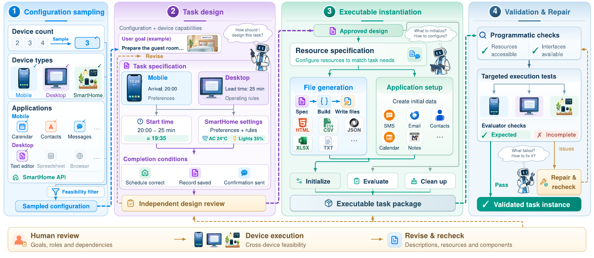

# Task-construction figure

## 主图：用户提供的原始 PDF

[DevicesWorld_task_construction (13).pdf](DevicesWorld_task_construction%20%2813%29.pdf) 原样复制，保留文件内容与原文件名，未裁切、改字或重新导出。原文件为一页，页面尺寸 1800 × 783 pt。

上图是对原 PDF 的网页预览，不取代原始矢量 PDF。已渲染检查整页，未见遮挡或裁切。本次未收到与此 PDF 对应的 PPTX/SVG 可编辑原稿。

## 与附录 A 文字的对应

四栏依次对应配置采样、任务设计、可执行实例化、验证与修复；底部表达人工审查、设备执行及针对性复验。它适合作为论文的概念流程总览。

为避免把示意图扩写成代码/实测事实，正文和图注应保留以下解释：

1. 图涵盖 Mobile/Desktop/SmartHome 的整体构建范式；当前统一 Stage0–Stage8 引擎的 active profile 是 Android/Linux，SmartHome 任务还使用其他 builder 路线。
2. 当前 Stage0 对六种设备组合轮转，再随机选 surface/setup；图中 “Device count: Sample” 不意味着代码先独立随机抽设备数，再随机抽设备类型。
3. “Independent design review” 可解释为与设计分开的审查环节。当前模型 pipeline 的审查调用沿用传入的 model/provider，不能仅凭图声称独立 reviewer 模型或每条任务人工审过。
4. “Targeted execution tests” 与 “Validated task instance” 描述验证目标/流程；实际证据须区分静态校验、setup smoke、正负例 oracle 和普通 agent/人操作。不能据图推导全池每条任务均完成了所有层级。
5. 图中客房准备是示意场景；A.1 的真实配置案例是日历同步。两者不被说成同一个任务，也不把示意值当作已归档配置。

建议英文图注：

> **Task-construction overview.** Configuration sampling defines the device and application space; task design specifies user goals, cross-device dependencies, and completion conditions; executable instantiation realizes resources and environment components; validation identifies issues for targeted repair and rechecking. The diagram summarizes the construction paradigm, while the accompanying appendix distinguishes the implemented generation routes and the available validation evidence.

## 补充图：当前代码映射参考

[SVG](implementation_reference/task_construction_pipeline.svg)、[PNG](implementation_reference/task_construction_pipeline.png)、[Mermaid](implementation_reference/task_construction_pipeline.mmd) 是此前按已检查代码整理的简化参考图，强调 Stage0–Stage8、其他来源路线和 Lite 筛选的区别。它们不是用户主图的可编辑源文件，也不覆盖或替换主图。
